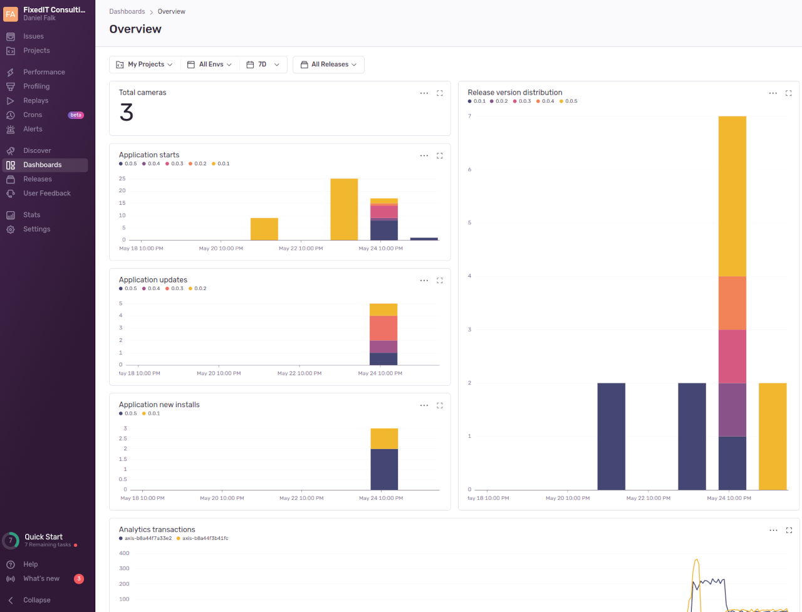
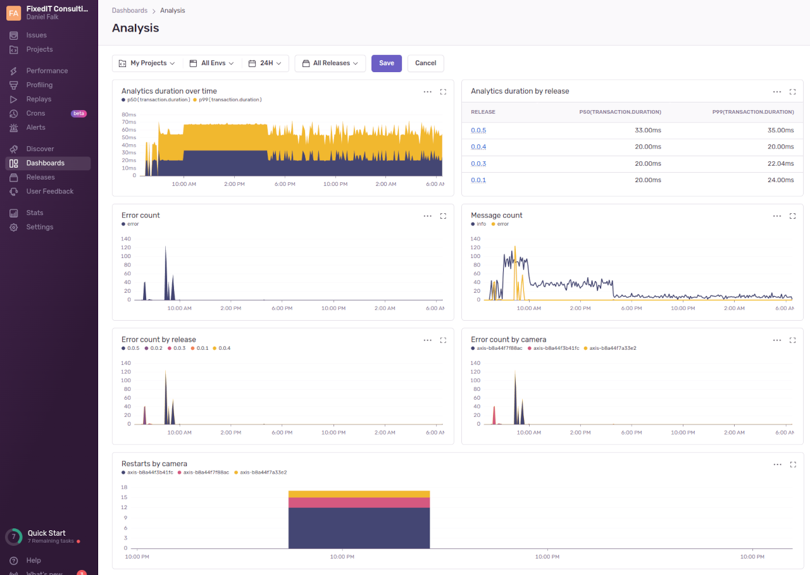
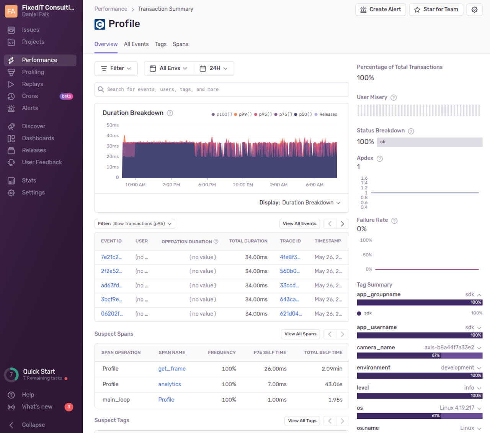
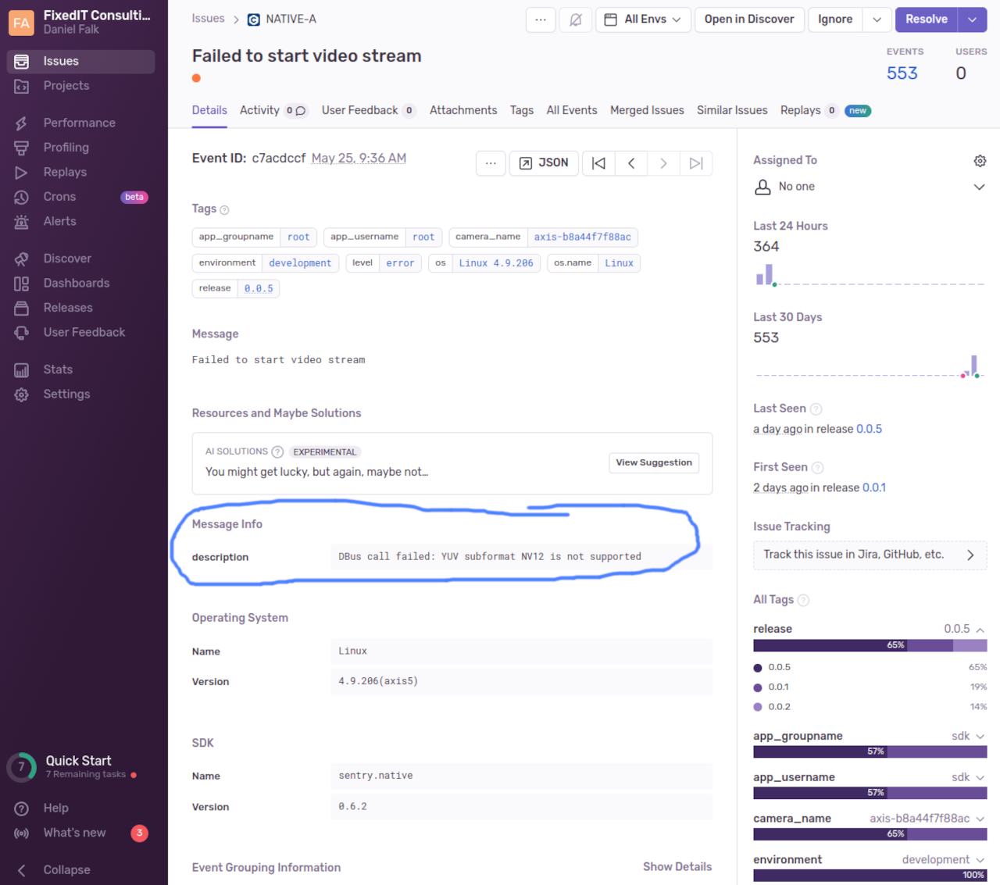

[](https://github.com/fixedit-ai/Axis-ACAP-guides/actions/workflows/build_fapp_sentry_example.yml)

# FApp ACAP with remote logging to Sentry.io
This application shows how to use FixedIT's precompiled sentry client to remotelly log metrics, performance and crashes to the [sentry.io](https://sentry.io) web service.

First look at the [FApp cURL application](https://github.com/fixedit-ai/Axis-ACAP-guides/tree/main/fapp/curl_example) to understand the structure of a camera application built with FixedIT's tools and libraries. This application expands on the technologies you learn about there.

## Logging metrics and profiling information
Sentry can be used to remotelly log telemetry data from your connected devices in production. To ensure high quality and robustness of the software we write for the Axis network cameras we make use of telemetry data sent to Sentry which we can inspect using dashboards and interactive analysis interfaces to find any errors or issues or even see tendencies before they cause issues. Telemetry data can contain a lot of different information:
- Device information
  * What firmware, ACAP version, camera model, etc are the customers using?
  * Is the CPU load and the memory usage normal?
- Application profiling
  * How much time does the different algorithms consume, and how does it differ between different cameras?
- Error tracking
  * What errors are occuring in production and how common are they?
  * What happened to the application before the error happened?

In the following images we can see some of the cloud interfaces that we have built using the telemetry data logged from this example application.


The overview dashboard is designed to give a quick high-level overview of how the application is used. We can see e.g. the adoption of new versions of the application.



The analysis dashboard is designed to give easy access to information that is helpful to determine the health of the applications. We can see information such as number of errors happening in the applications, we can see the cameras with the most number of application restarts which indicate issues with either the application or the camera installation, etc.



We can dig into profiling information and see how much time the different parts of the algorithms consumes. We can filter on camera, application version, etc. and see long-term trends.



With the error inbox we can monitor new previously unseen errors or track the frequency of known errors. We can drilldown into a specific error and see which cameras and application versions are affected. In this image we can see that the application was installed in a camera that doesn't support the image format that we try to use for the analytics.



## Build and install
The application is built with `fappcli` build tool. All the build options such as prebuilt libraries to pull when building are specified in the `fapp-manifest.json` file.

You need to login to your sentry.io account and create a unique DSN identifier. Then paste this identifier into the `fapp-manifest` files.

To build the application, simply run:
```bash
fappcli-build build .
```

To create a production build of the application where the sentry client logs to the production environment, run:
```bash
fappcli-build build . --build-arg SENTRY_ENV=production
```
This could also be achieved by creating a new `fapp-manifest.deploy.json` file with the value `SENTRY_ENV=production` in the `build.build_arg` array.

### Environment variables
These values are set by the fappcli build tool, both during the Docker build and the application build in the running container:
- `FAPP_APP_NAME`: The name of the app as taken from the manifest file
- `FAPP_APP_VERSION`: The version of the app as taken from the manifest file
- `SENTRY_DSN`: The unique sentry account specified, specified in the fapp-manifest file
- `SENTRY_ENV`: The environment to log to in sentry, specified in the fapp-manifest file
- `VERBOSE_OUTPUT`: Optional flag for verbose logging, (optionally) specified in the fapp-manifest file

### Libraries
This application is using the prebuilt docker library `sentry` which is a cross-compiled sentry client. This client is then used from the C-code. The `sentry` library depends on the `curl` library which depends on the `openssl` library, therefore these two are also specified in the fapp-manifest files. `libfapp` is the FixedIT base library that is used for logging and signal handling.
