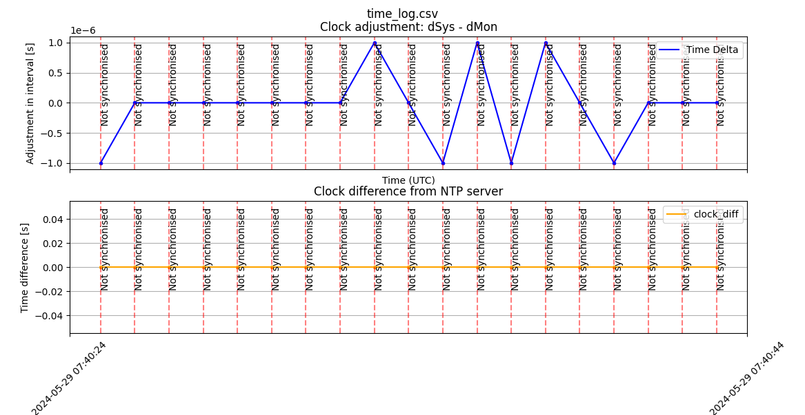

# NTP logging example
This ACAP will log the NTP error (clock difference) and the clock adjustments (due to sync). The result is first logged to a temporary file, then uploaded once per hour to an AWS S3 bucket using presigned keys.

This example shows how an ACAP can be used as a debugging tool to gain more insights from cameras at customers' sites. For you as an integrator / solution provider, it is easy to build the ACAP and send the .eap file to a customer who can easily install it in their camera. The logged data will be sent to your S3 bucket for you to investigate.

## Example plot
An example of the logged and plotted data can be seen here.

The upper graph shows the time adjustment in each 1-second period (monotonic time minus wall time). The lower graph shows the time difference from the NTP server as reported by the NTP client. The status of the NTP client in the camera is also visible, where a red vertical line represents "Not Synced".


If you see the status "Unknown" this is most likely because the camera is not configured to use an NTP server.

## Preparation
This application is making use of an AWS S3 bucket for data upload. First you need to create a bucket in your account where you want to store the uploads. For this guide, let's assume that you have created a bucket called `my.bucket`.

Before you can build the ACAP you need to generate presigned keys, these are temporary URLs that include the authentication needed to upload a file to a specific path. You can generate keys with the `generate_url.py` script. For this script to work, you need to have your AWS credentials set up such that the `boto3` library will find them, e.g. using environment variables, [see library instructions for more info](https://boto3.amazonaws.com/v1/documentation/api/latest/guide/credentials.html).

Note: Make sure to use an AWS profile that has upload permissions to the ingest bucket, otherwise the generation of the URLs will look successful, but the URLs will be useless and the ACAP upload attempts will fail.

```bash
python generate_url.py --bucket <BUCKET_NAME> --file-prefix <PREFIX> --output s3.env
```

You can also run `python generate_url.py --help` to show all available options:
```
Usage: generate_url.py [OPTIONS]

Options:
  --bucket TEXT               S3 bucket name
  --file-prefix TEXT          File prefix
  --expiration INTEGER RANGE  Expiration time in seconds  [1<=x<=604800]
  --output TEXT               Output file where the URLs are written
  --help                      Show this message and exit.
```

You might as an example run:
```bash
AWS_PROFILE=my_profile python generate_url.py --bucket my.bucket --file-prefix my_site/ --output s3.env
```

This will create an environment file that you then can source:
```bash
source s3.env
```

## Build
This application should be built using the [FixedIT CLI build tool](https://github.com/fixedit-ai/fappcli-readme). For additional information about applications built with the tool, you can check out [our hello world example](https://github.com/fixedit-ai/Axis-ACAP-guides/tree/main/fapp/hello_world).

You can then use the presigned URLs from the sourced environment (`s3.env` as created in the [Preparation section](#preparation)) when building the ACAP:
```
fixeditcli-build build --build-arg PRESIGNED_URL_TIME_LOG="$TIME_LOG_CSV" --build-arg PRESIGNED_URL_NTP_STATUS="$NTP_STATUS_TXT" --build-arg PRESIGNED_URL_NTP_FAILED_STATUS="$NTP_FAILED_STATUS_TXT"
```

For persistent configuration, you could instead add the values to the `fixedit-manifest.json` file.

To use another upload interval, you can either specify it when building the ACAP with `--build-arg UPLOAD_INTERVAL_S=<UPLOAD_INTERVAL_IN_SECONDS>` or you can make use of multiple FixedIT manifest files, e.g. `--fixedit-manifest fixedit-manifest.hourly.json`.

## Inspect data
The application will upload three files:

* <PREFIX>ntp_failed_status.txt
* <PREFIX>ntp_status.txt
* <PREFIX>time_log.csv

The `ntp_status.txt` and `time_log.csv` files will be uploaded every `UPLOAD_INTERVAL_S` seconds. The CSV file contains the data sampled every second while the `ntp_status.txt` file contains the latest status info. The `ntp_failed_status.txt` file will only be uploaded if there was a failed status since the last upload. 

To plot the CSV data, you can make use of the `plot.py` script.
```bash
python plot.py s3://<BUCKET_NAME>/<PREFIX>time_log.csv
```
Where path can be the S3 path starting with `s3://` or it can be a local path.

You can also run `python plot.py --help` to show the help:
```
python plot.py --help
Usage: plot.py [OPTIONS] FILEPATH

Options:
  --title TEXT
  --version-index INTEGER
  --help                   Show this message and exit.
```

Given the bucket name and prefix specified above, you could run:
```bash
AWS_PROFILE=my_profile python plot.py s3://my.bucket/my_site/time_log.csv
```

Doing so will show the latest upload. You can also specify `--version-index <INDEX>` where `<INDEX>` is the uploaded file:
- `-1` is the latest upload
- `-2` the second latest upload
- and so on...

For example, if the upload time is set to one file per hour, then setting `version-index` to `-24` would retrieve the file uploaded at the same hour the previous day.

If you have the AWS CLI installed, you can show the files and their latest upload time. This might be useful to know when the last failed state was uploaded, e.g.:
```bash
aws s3 ls s3://<BUCKET_NAME>/<PREFIX>/
```

The following output shows that the last NTP sync failure occurred at 8:10 PM, July 4th.
```
2024-07-04 20:10:59        456 dev-daniel/ntp_failed_status.txt
2024-07-04 20:37:05        464 dev-daniel/ntp_status.txt
2024-07-04 20:37:05       1470 dev-daniel/time_log.csv
```
Based on this you can calculate the `<INDEX>` to find the corresponding plot.

## Requirements
This application requires [FixedIT CLI](https://github.com/fixedit-ai/fappcli-readme) version 0.4.0 or higher.

## Known Limitations
Checking the NTP status is expected to fail in older device software (e.g. LTS 2020) where `chronyc` is not available. Tracking the time difference still works.