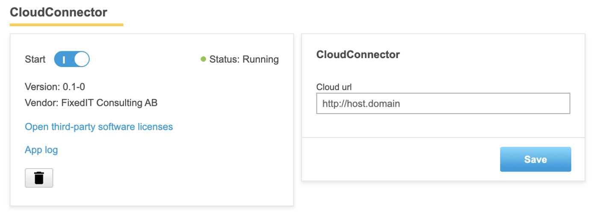

# ACAP 3 application example with parameter handler
In the SDK 3 runtime there is included functionality for parameter handlers. This simplifies the configuration of ACAP applications since there is no need for the application to have its own webpages for configuration. Instead the `axparameter` library is used. When the application is installed the parameters are created in the cameras global parameter handler acording to the specification in the `manifest.json` file. These parameters are then modifiable using the cameras web GUI in the "Application" tab, the VAPIX API or the `parhandclient` command in the camera using e.g. ssh.



To build and install the application, run:
```bash
make build
make install-eap
```

The application can then be found in the camera web interface. When the application is started it prints a message with the read parameter to the system log:
```
2022-04-23T18:45:41.126+02:00 axis-b8a44f39f301 [ INFO    ] ParameterhandlerTest[14585]: Initializing application
2022-04-23T18:45:41.182+02:00 axis-b8a44f39f301 [ INFO    ] ParameterhandlerTest[14585]: Reporting to server: http://host.domain
2022-04-23T18:45:41.182+02:00 axis-b8a44f39f301 [ INFO    ] ParameterhandlerTest[14585]: Set up finished.
```

## Known issues
The `axparameter` library is not included in the later SDK (SDK 4) and will likely be deprecated. The library does also suffer from quite a few bugs and issues, e.g. the application nor the parameters name must not contain any other characters than a-z, A-Z or 0-9, i.e. no dash or underscore, otherwise the parameter handler will fail to deal with the applications parameters.
